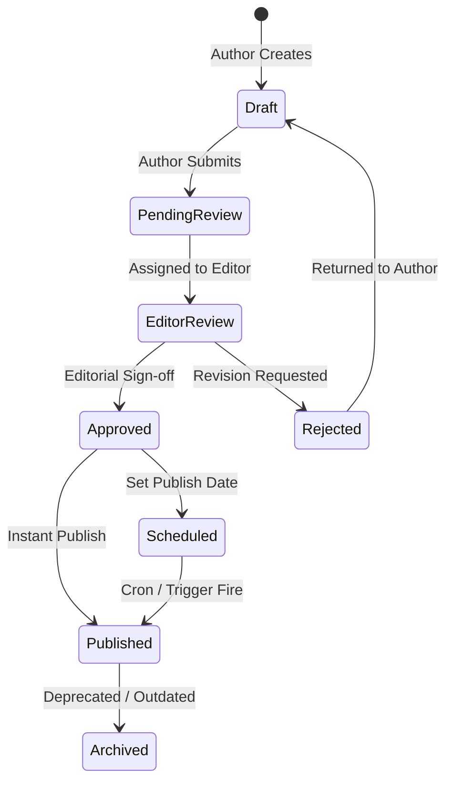

# CyberNews AI - Enterprise Content Management System (CMS) Architecture & Blueprint

> **System Designation**: CyberNews AI Enterprise CMS (`C-CMS v4.0`)  
> **Target Persona**: Enterprise Editors-in-Chief, Senior Reporters, AI Content Curators, Security Auditors, and System Administrators  
> **Tech Stack**: React 18, TypeScript, Tailwind CSS, Supabase PostgreSQL, Realtime Subscriptions, Row Level Security (RLS)  

---

## 1. CMS Executive Summary & Objectives

The CyberNews AI CMS is a high-performance, real-time editorial platform built to manage millions of articles, dynamic multi-author workflows, autonomous AI generation pipelines, ad monetization, and granular RBAC security.

### Core Objectives:
1. **Frictionless Multi-Author Publishing**: Support concurrent newsroom editing with real-time article locking, version rollback, and automated AI assistance.
2. **Strict Editorial Governance**: 7-stage approval workflow with cryptographically enforced Role-Based Access Control (RBAC).
3. **Omnichannel Distribution**: Simultaneous publishing across web, RSS, push notifications, mobile apps, and social newsletters.
4. **Autonomous AI Studio**: Integrated Gemini 2.5 Flash agents for instant headline generation, multi-language translation, SEO optimization, and fact-checking.

---

## 2. CMS Information Architecture & Navigation Structure

```
[CMS Root: /admin]
├── 📊 Executive Dashboard (Realtime Analytics, Traffic Spikes, Error Logs)
├── 📰 Content Management
│   ├── All Articles (Grid / Table view, Status filters, Bulk actions)
│   ├── Article Editor (Block Editor, AI Studio, SEO Inspector, Revision History)
│   ├── Drafts & Scheduled (Queue management)
│   └── Breaking News Ticker Manager
├── 🗂️ Taxonomy & Structure
│   ├── Categories & Subcategories
│   ├── Global Tags & Cloud
│   └── Menu & Navigation Builder
├── 🖼️ Media & Asset Library
│   ├── Cloud Storage Bucket (Supabase Storage)
│   ├── Folder Hierarchies
│   └── Automated WebP / Crop & AI Alt-Text Generator
├── 👥 User & Workforce Management
│   ├── Profiles & Reporters Directory
│   ├── Roles & Granular Permissions Matrix
│   └── Session & Device Security Audits
├── 📈 Monetization & Marketing
│   ├── Advertisement Campaign Planner (Banners, Inline, Sticky)
│   ├── Newsletter Subscribers & Broadcast Campaigns
│   └── RSS & Sitemap Sync Engine
├── 🛡️ Moderation & Security
│   ├── Comment Moderation Queue & Spam Filter
│   ├── Content & User Report Queue
│   └── Immutable Audit Logs & Security Alerts
└── ⚙️ System Settings & Diagnostics
    ├── General, Theme & SEO Config
    ├── Database Health & Storage Usage
    ├── Feature Flags & Maintenance Mode
    └── API Health & Rate Limit Monitors
```

---

## 3. Comprehensive CMS Screen Inventory

1. **`CMSDashboardView`**: High-level telemetry, active concurrent visitors, recent editorial actions, and server health.
2. **`ArticleListView`**: Advanced filtering (Status, Category, Author), sorting, batch publish/archive, and export tools.
3. **`AdvancedArticleEditorView`**: Split-pane writing interface with block management, live preview, SEO meter, and AI Assistant sidebar.
4. **`MediaLibraryView`**: Grid explorer with drag-and-drop uploader, folder navigation, and image cropping modal.
5. **`TaxonomyManagerView`**: Category tree builder and tag cloud management.
6. **`UserRoleMatrixView`**: Interactive permission grid for Roles vs. Permissions.
7. **`AdCampaignManagerView`**: Banner placement scheduler and impression/click analytics.
8. **`NewsletterStudioView`**: Email subscriber segmenter and campaign broadcast designer.
9. **`ModerationQueueView`**: Comment review and report resolution desk.
10. **`AuditLogsView`**: Searchable chronological stream of all system and user mutations.
11. **`SystemSettingsView`**: Global environment toggles, database health gauges, and API token vaults.

---

## 4. Publishing Workflow & State Machine



### Role Permission Matrix

| Role | Create Draft | Submit Review | Edit Any Article | Approve/Publish | Delete Article | Manage Users | View Audit Logs |
| :--- | :---: | :---: | :---: | :---: | :---: | :---: | :---: |
| **Reporter** | ✅ | ✅ | ❌ | ❌ | ❌ | ❌ | ❌ |
| **Editor** | ✅ | ✅ | ✅ | ✅ | ❌ | ❌ | ❌ |
| **Chief Editor** | ✅ | ✅ | ✅ | ✅ | ✅ | ❌ | ⚠️ Read |
| **Administrator** | ✅ | ✅ | ✅ | ✅ | ✅ | ✅ | ✅ |

---

## 5. Reusable Component Inventory

* `CMSLayout`: Sidebar navigation, responsive mobile hamburger drawer, breadcrumbs, user profile dropdown, and notification badge.
* `DataTable`: Generic virtualized table with column sorting, multi-select checkboxes, search filtering, and pagination.
* `BlockEditor`: Rich text editing surface with slash command menu (`/heading`, `/image`, `/ai-rewrite`, `/callout`).
* `SEOScoreCard`: Real-time SEO analysis widget checking title length, keyword density, meta description, and readability.
* `AIStudioDrawer`: Slide-over panel connecting directly to Gemini 2.5 Flash for content generation and translation.
* `MediaPickerModal`: File browser with search, multi-select, and direct Supabase storage upload.

---

## 6. Security, Performance & Scalability Strategy

* **Row Level Security (RLS)**: Enforced on every table matching Supabase Auth UID and role claims.
* **Optimistic UI Updates**: Instant client-side feedback during article saving and status toggles.
* **Caching & Indexes**: Composite indexes on `(status, published_at)` and GIN search indexes on article content vectors.
* **Audit Trail**: PostgreSQL triggers logging every `INSERT`, `UPDATE`, and `DELETE` on sensitive tables into `audit_logs`.
