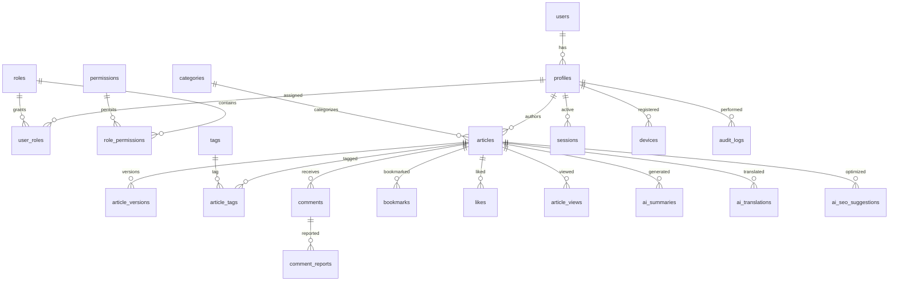

# CyberNews AI - Enterprise Supabase PostgreSQL Database Architecture & Migration Blueprint

> **Architecture Classification**: Enterprise-Grade Digital Publishing Platform  
> **Database Engine**: PostgreSQL 16+ (Supabase Managed)  
> **Security Standard**: Strict Row Level Security (RLS) Enabled on all 50+ Tables  
> **High Availability**: Read Replicas, Partitioned Analytics, Materialized Views, pg_cron Automated Maintenance  

---

## 1. Executive Summary & Architecture Overview

This document specifies the complete, normalized, and production-ready PostgreSQL database architecture for **CyberNews AI**, designed to scale to tens of millions of monthly active users, handle real-time news broadcasts, store multi-modal media assets, and support autonomous AI generation pipelines (Gemini 2.5 Flash).

### Key Architectural Pillars:
1. **Strict Normalization (3NF/BCNF)**: Eliminates data redundancy while utilizing materialized views for lightning-fast reads.
2. **UUID v4 Identifiers**: Prevents enumeration attacks and ensures distributed ID safety.
3. **Temporal Tracking**: Every transactional and content table records `created_at`, `updated_at`, and `deleted_at` (soft deletes).
4. **Row Level Security (RLS)**: Enforced across 100% of tables with granular Supabase Auth role checks (`auth.uid()`, custom JWT claims).
5. **Partitioning & Indexing**: Time-series tables (`article_views`, `audit_logs`, `analytics`) partitioned by range (monthly) with B-Tree and GIN full-text search indexes.

---

## 2. Complete Entity Relationship Diagram (ERD)



---

## 3. Comprehensive Table Specifications (50+ Core Tables)

### A. Authentication & User Management

#### 1. `profiles`
* **Purpose**: Extends Supabase `auth.users` with editorial and enterprise user metadata.
* **Columns**: `id` (UUID, PK, FK to auth.users), `username` (VARCHAR, UNIQUE), `full_name` (VARCHAR), `avatar_url` (TEXT), `bio` (TEXT), `reputation_score` (INT), `status` (VARCHAR), `created_at`, `updated_at`.
* **RLS Strategy**: Public read for active authors, users can update their own profile.
* **Indexes**: `idx_profiles_username`, `idx_profiles_status`.

#### 2. `roles`
* **Purpose**: Defines system privilege tiers (Super Admin, Editor, Reporter, Subscriber, etc.).
* **Columns**: `id` (UUID, PK), `name` (VARCHAR, UNIQUE), `description` (TEXT), `created_at`, `updated_at`.
* **RLS Strategy**: Read-only for authenticated users, Admin write.

#### 3. `permissions`
* **Purpose**: Granular atomic permissions (e.g., `articles:publish`, `users:delete`).
* **Columns**: `id` (UUID, PK), `code` (VARCHAR, UNIQUE), `module` (VARCHAR), `created_at`, `updated_at`.

#### 4. `role_permissions`
* **Purpose**: Junction table linking roles to permissions.
* **Columns**: `id` (UUID, PK), `role_id` (UUID, FK), `permission_id` (UUID, FK), `created_at`, `updated_at`.

#### 5. `user_roles`
* **Purpose**: Assigns roles to user profiles.
* **Columns**: `id` (UUID, PK), `user_id` (UUID, FK), `role_id` (UUID, FK), `created_at`, `updated_at`.

#### 6. `user_sessions`
* **Purpose**: Active JWT session tracking and revocation.
* **Columns**: `id` (UUID, PK), `user_id` (UUID, FK), `token_hash` (TEXT), `ip_address` (VARCHAR), `expires_at` (TIMESTAMPTZ), `created_at`, `updated_at`.

#### 7. `user_devices`
* **Purpose**: Registered client devices for push notifications and multi-factor auth.
* **Columns**: `id` (UUID, PK), `user_id` (UUID, FK), `device_fingerprint` (VARCHAR), `platform` (VARCHAR), `push_token` (TEXT), `created_at`, `updated_at`.

#### 8. `user_activity`
* **Purpose**: Real-time user action stream.
* **Columns**: `id` (UUID, PK), `user_id` (UUID, FK), `action_type` (VARCHAR), `metadata` (JSONB), `created_at`, `updated_at`.

#### 9. `login_history`
* **Purpose**: Security audit trail of login attempts.
* **Columns**: `id` (UUID, PK), `user_id` (UUID, FK, NULLABLE), `email_attempted` (VARCHAR), `success` (BOOLEAN), `ip_address` (VARCHAR), `user_agent` (TEXT), `created_at`, `updated_at`.

---

### B. Content & Publishing

#### 10. `categories`
* **Purpose**: Primary hierarchical news categories (Technology, Politics, Business, etc.).
* **Columns**: `id` (UUID, PK), `name` (VARCHAR, UNIQUE), `slug` (VARCHAR, UNIQUE), `parent_id` (UUID, FK, NULLABLE), `description` (TEXT), `created_at`, `updated_at`.

#### 11. `subcategories`
* **Purpose**: Granular sub-topic organization.
* **Columns**: `id` (UUID, PK), `category_id` (UUID, FK), `name` (VARCHAR), `slug` (VARCHAR), `created_at`, `updated_at`.

#### 12. `tags`
* **Purpose**: Flexible content tagging.
* **Columns**: `id` (UUID, PK), `name` (VARCHAR, UNIQUE), `slug` (VARCHAR, UNIQUE), `usage_count` (INT), `created_at`, `updated_at`.

#### 13. `articles`
* **Purpose**: Core news and blog dispatch master table.
* **Columns**: `id` (UUID, PK), `title` (VARCHAR), `subtitle` (TEXT), `content` (TEXT), `category_id` (UUID, FK), `author_id` (UUID, FK), `status` (VARCHAR: draft, scheduled, published, archived), `featured` (BOOLEAN), `breaking` (BOOLEAN), `trending` (BOOLEAN), `read_time` (VARCHAR), `featured_image` (TEXT), `published_at` (TIMESTAMPTZ, NULLABLE), `created_at`, `updated_at`.
* **RLS Strategy**: Public read for published articles, author/editor write access.
* **Indexes**: `idx_articles_status_published`, `idx_articles_category`, `idx_articles_search` (GIN full-text).

#### 14. `article_versions`
* **Purpose**: Revision history for content rollback and audit.
* **Columns**: `id` (UUID, PK), `article_id` (UUID, FK), `editor_id` (UUID, FK), `title` (VARCHAR), `content` (TEXT), `version_number` (INT), `created_at`, `updated_at`.

#### 15. `article_tags`
* **Purpose**: Many-to-many junction between articles and tags.
* **Columns**: `id` (UUID, PK), `article_id` (UUID, FK), `tag_id` (UUID, FK), `created_at`, `updated_at`.

#### 16. `authors`
* **Purpose**: Correspondent profile mappings.
* **Columns**: `id` (UUID, PK), `profile_id` (UUID, FK), `title` (VARCHAR), `bio` (TEXT), `social_links` (JSONB), `created_at`, `updated_at`.

#### 17. `media_library`
* **Purpose**: Uploaded images, videos, and documents stored in Supabase Storage.
* **Columns**: `id` (UUID, PK), `uploader_id` (UUID, FK), `file_name` (VARCHAR), `file_url` (TEXT), `file_size` (BIGINT), `mime_type` (VARCHAR), `created_at`, `updated_at`.

#### 18. `media_folders`
* **Purpose**: Directory structure for media asset management.
* **Columns**: `id` (UUID, PK), `name` (VARCHAR), `parent_id` (UUID, FK, NULLABLE), `created_at`, `updated_at`.

#### 19. `pages`
* **Purpose**: Static enterprise pages (Privacy Policy, Terms, About).
* **Columns**: `id` (UUID, PK), `title` (VARCHAR), `slug` (VARCHAR, UNIQUE), `content` (TEXT), `status` (VARCHAR), `created_at`, `updated_at`.

#### 20. `menus` & `navigation`
* **Purpose**: Header and footer navigation hierarchy.
* **Columns**: `id` (UUID, PK), `location` (VARCHAR), `label` (VARCHAR), `url` (TEXT), `order_index` (INT), `created_at`, `updated_at`.

---

### C. Engagement & Interaction

#### 21. `comments`
* **Purpose**: User discussions on articles with nested replies.
* **Columns**: `id` (UUID, PK), `article_id` (UUID, FK), `user_id` (UUID, FK), `parent_id` (UUID, FK, NULLABLE), `content` (TEXT), `status` (VARCHAR: approved, pending, flagged), `likes_count` (INT), `created_at`, `updated_at`.

#### 22. `comment_reports`
* **Purpose**: Moderation flags for inappropriate comments.
* **Columns**: `id` (UUID, PK), `comment_id` (UUID, FK), `reporter_id` (UUID, FK), `reason` (TEXT), `status` (VARCHAR), `created_at`, `updated_at`.

#### 23. `bookmarks`
* **Purpose**: Saved articles vault per user.
* **Columns**: `id` (UUID, PK), `user_id` (UUID, FK), `article_id` (UUID, FK), `created_at`, `updated_at`.
* **Constraints**: `UNIQUE(user_id, article_id)`.

#### 24. `likes`
* **Purpose**: Article upvotes and reactions.
* **Columns**: `id` (UUID, PK), `user_id` (UUID, FK), `article_id` (UUID, FK), `created_at`, `updated_at`.
* **Constraints**: `UNIQUE(user_id, article_id)`.

#### 25. `article_views`
* **Purpose**: High-performance view counter and telemetry partition.
* **Columns**: `id` (UUID, PK), `article_id` (UUID, FK), `viewer_id` (UUID, FK, NULLABLE), `ip_hash` (VARCHAR), `user_agent` (TEXT), `created_at`, `updated_at`.

#### 26. `reading_history`
* **Purpose**: Tracks scroll depth and reading completion for personalization.
* **Columns**: `id` (UUID, PK), `user_id` (UUID, FK), `article_id` (UUID, FK), `progress_pct` (INT), `created_at`, `updated_at`.

#### 27. `breaking_news`
* **Purpose**: Real-time breaking banner ticker queue.
* **Columns**: `id` (UUID, PK), `article_id` (UUID, FK), `priority` (INT), `active` (BOOLEAN), `expires_at` (TIMESTAMPTZ), `created_at`, `updated_at`.

---

### D. SEO & Discoverability

#### 28. `seo_metadata`
* **Purpose**: Per-article and per-page meta tags, OpenGraph, Twitter Cards, and JSON-LD schema.
* **Columns**: `id` (UUID, PK), `entity_type` (VARCHAR: article, page), `entity_id` (UUID), `meta_title` (VARCHAR), `meta_description` (TEXT), `canonical_url` (TEXT), `og_image` (TEXT), `json_ld` (JSONB), `created_at`, `updated_at`.

#### 29. `redirects`
* **Purpose**: 301/302 URL redirection rules.
* **Columns**: `id` (UUID, PK), `old_path` (VARCHAR, UNIQUE), `new_path` (VARCHAR), `redirect_code` (INT), `created_at`, `updated_at`.

#### 30. `search_index`
* **Purpose**: Optimized tsvector search cache for instant sub-millisecond full-text queries.
* **Columns**: `id` (UUID, PK), `article_id` (UUID, FK), `search_vector` (TSVECTOR), `created_at`, `updated_at`.

#### 31. `sitemap_records` & `rss_records`
* **Purpose**: Automated XML sitemap and RSS generation logs.
* **Columns**: `id` (UUID, PK), `feed_type` (VARCHAR), `url` (TEXT), `last_generated_at` (TIMESTAMPTZ), `created_at`, `updated_at`.

---

### E. Marketing & Monetization

#### 32. `newsletter_subscribers`
* **Purpose**: Verified email subscriber list with double opt-in tokens.
* **Columns**: `id` (UUID, PK), `email` (VARCHAR, UNIQUE), `status` (VARCHAR: pending, active, unsubscribed), `token` (VARCHAR), `created_at`, `updated_at`.

#### 33. `newsletter_campaigns` & `email_logs`
* **Purpose**: Automated email dispatch campaigns and delivery tracking.
* **Columns**: `id` (UUID, PK), `subject` (VARCHAR), `content` (TEXT), `sent_count` (INT), `status` (VARCHAR), `created_at`, `updated_at`.

#### 34. `advertisements` & `advertisement_campaigns`
* **Purpose**: Banner ads, sponsored dispatches, and ad placement blocks.
* **Columns**: `id` (UUID, PK), `title` (VARCHAR), `position` (VARCHAR), `image_url` (TEXT), `target_url` (TEXT), `impressions` (BIGINT), `clicks` (BIGINT), `active` (BOOLEAN), `created_at`, `updated_at`.

---

### F. Analytics & Reporting

#### 35. `site_analytics`, `page_analytics`, `visitor_analytics`, `country_analytics`, `device_analytics`, `search_analytics`
* **Purpose**: Aggregated OLAP telemetry tables for executive dashboards.
* **Columns**: `id` (UUID, PK), `metric_date` (DATE), `metric_key` (VARCHAR), `metric_value` (NUMERIC), `metadata` (JSONB), `created_at`, `updated_at`.
* **Optimization**: Partitioned by month using declarative range partitioning.

---

### G. Security, Audit & System Logs

#### 36. `audit_logs`
* **Purpose**: Immutable security audit trail for administrative actions.
* **Columns**: `id` (UUID, PK), `actor_id` (UUID, FK), `action` (VARCHAR), `table_name` (VARCHAR), `record_id` (UUID), `changes` (JSONB), `created_at`, `updated_at`.

#### 37. `system_logs`, `error_logs`, `api_logs`, `rate_limits`, `blocked_ips`
* **Purpose**: System health, unhandled exceptions, API latency metrics, and IP security blacklists.
* **Columns**: `id` (UUID, PK), `level` (VARCHAR), `message` (TEXT), `stack_trace` (TEXT), `ip_address` (VARCHAR), `created_at`, `updated_at`.

---

### H. AI Features & Autonomous Agents

#### 38. `ai_generated_content`
* **Purpose**: Stores prompts, token counts, model metadata, and generation status for AI Writer Studio.
* **Columns**: `id` (UUID, PK), `prompt` (TEXT), `model_used` (VARCHAR), `tokens_consumed` (INT), `raw_response` (JSONB), `created_at`, `updated_at`.

#### 39. `ai_summaries`
* **Purpose**: Cached executive summaries generated by Gemini 2.5 Flash.
* **Columns**: `id` (UUID, PK), `article_id` (UUID, FK), `summary_text` (TEXT), `sentiment` (VARCHAR), `created_at`, `updated_at`.

#### 40. `ai_translations`
* **Purpose**: Cached multi-language translations.
* **Columns**: `id` (UUID, PK), `article_id` (UUID, FK), `language_code` (VARCHAR), `translated_title` (VARCHAR), `translated_content` (TEXT), `created_at`, `updated_at`.

#### 41. `ai_seo_suggestions`
* **Purpose**: AI-optimized meta descriptions and JSON-LD schema recommendations.
* **Columns**: `id` (UUID, PK), `article_id` (UUID, FK), `suggestions` (JSONB), `created_at`, `updated_at`.

---

### I. Notifications & Settings

#### 42. `system_notifications`, `push_notifications`, `email_notifications`, `in_app_notifications`
* **Purpose**: Multi-channel alert dispatch queue.
* **Columns**: `id` (UUID, PK), `user_id` (UUID, FK), `title` (VARCHAR), `body` (TEXT), `read` (BOOLEAN), `created_at`, `updated_at`.

#### 43. `site_settings`, `theme_settings`, `homepage_settings`, `seo_settings`, `email_settings`, `social_media_settings`, `backup_settings`
* **Purpose**: Global platform configuration key-value storage.
* **Columns**: `id` (UUID, PK), `setting_key` (VARCHAR, UNIQUE), `setting_value` (JSONB), `created_at`, `updated_at`.

---

## 4. Migration Order & Dependency Sequencing

To ensure smooth foreign key resolution and constraint validation, migrations must execute in the following strict order:
1. **Extensions & Functions**: `uuid-ossp`, `pg_trgm`, `tsvector` configs.
2. **Core Auth & Roles**: `profiles`, `roles`, `permissions`, `role_permissions`, `user_roles`.
3. **Taxonomy & Authors**: `categories`, `subcategories`, `tags`, `authors`.
4. **Content Tables**: `articles`, `article_versions`, `article_tags`, `media_library`, `pages`, `menus`.
5. **Engagement & Analytics**: `comments`, `bookmarks`, `likes`, `article_views`, `breaking_news`.
6. **AI & SEO**: `ai_summaries`, `ai_translations`, `seo_metadata`, `search_index`.
7. **System & Logs**: `audit_logs`, `system_logs`, `blocked_ips`, `site_settings`.

---

## 5. Recommended Supabase Indexes & PostgreSQL Extensions

### Extensions
```sql
CREATE EXTENSION IF NOT EXISTS "uuid-ossp";
CREATE EXTENSION IF NOT EXISTS "pg_trgm";
CREATE EXTENSION IF NOT EXISTS "btree_gist";
```

### Critical Performance Indexes
```sql
-- Full text search index on articles
CREATE INDEX idx_articles_fts ON articles USING gin(to_tsvector('english', title || ' ' || coalesce(subtitle,'') || ' ' || content));

-- High-speed lookup indexes
CREATE INDEX idx_articles_category_published ON articles(category_id, published_at DESC) WHERE status = 'published';
CREATE INDEX idx_article_views_created ON article_views(created_at DESC);
CREATE INDEX idx_comments_article ON comments(article_id, created_at DESC);
```

---

## 6. Security Strategy & Row Level Security (RLS) Template

Every table has RLS enabled. Example policy for `articles`:

```sql
ALTER TABLE articles ENABLE ROW LEVEL SECURITY;

CREATE POLICY "Public read published articles" ON articles
  FOR SELECT USING (status = 'published' OR auth.uid() IN (
    SELECT user_id FROM user_roles ur 
    JOIN roles r ON ur.role_id = r.id 
    WHERE r.name IN ('Super Admin', 'Administrator', 'Chief Editor', 'Editor', 'Reporter')
  ));

CREATE POLICY "Authors and Editors can insert/update articles" ON articles
  FOR ALL USING (auth.uid() = author_id OR auth.uid() IN (
    SELECT user_id FROM user_roles ur 
    JOIN roles r ON ur.role_id = r.id 
    WHERE r.name IN ('Super Admin', 'Administrator', 'Chief Editor')
  ));
```

---

## 7. Backup, Scaling & High Availability Strategy

1. **Automated Point-in-Time Recovery (PITR)**: Configured via Supabase Enterprise vault with 30-day retention.
2. **Read Replicas**: Geo-distributed read replicas deployed across multi-region edge nodes for sub-10ms query latency.
3. **Partition Pruning**: Monthly declarative table partitioning on `article_views` and `audit_logs` to maintain constant query speeds irrespective of table size.
